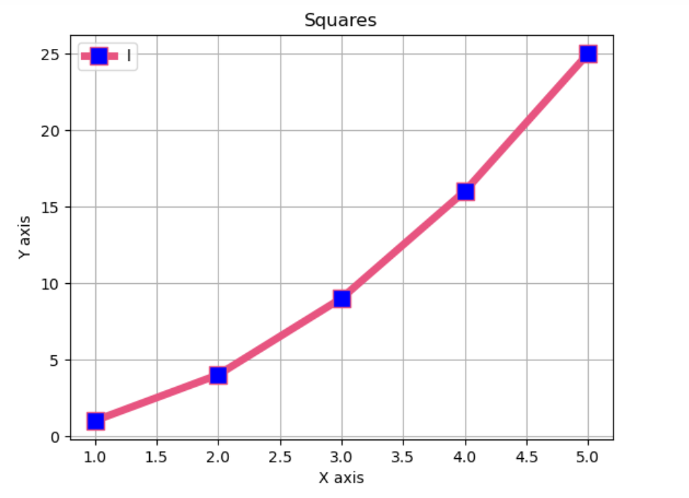
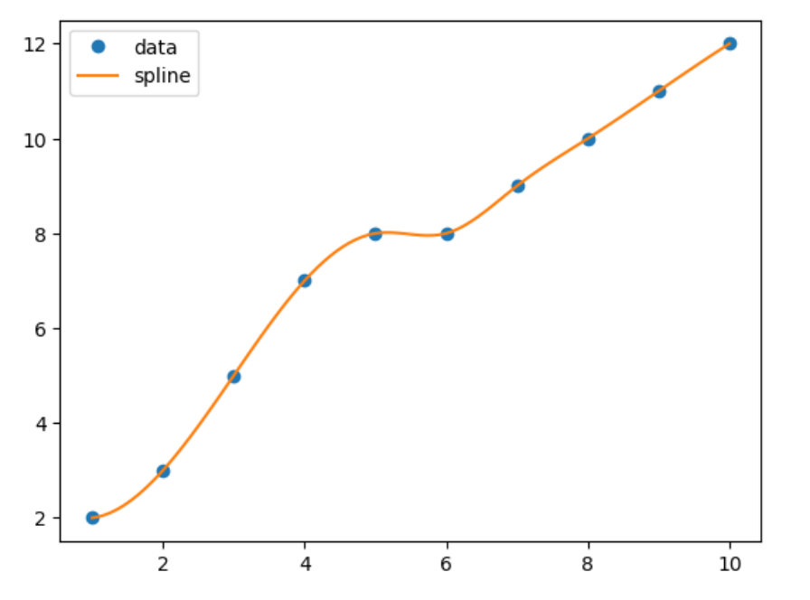
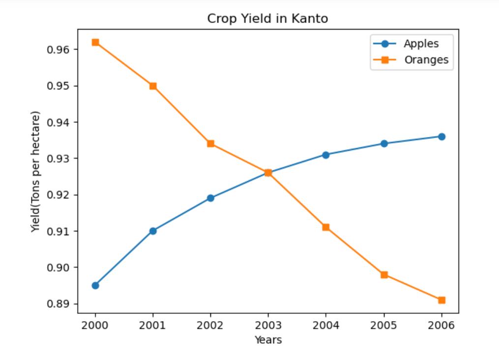
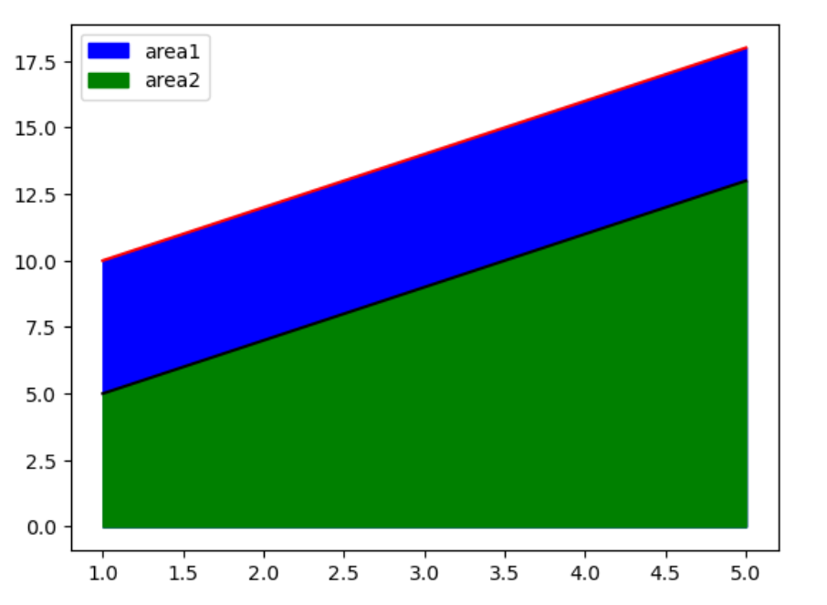
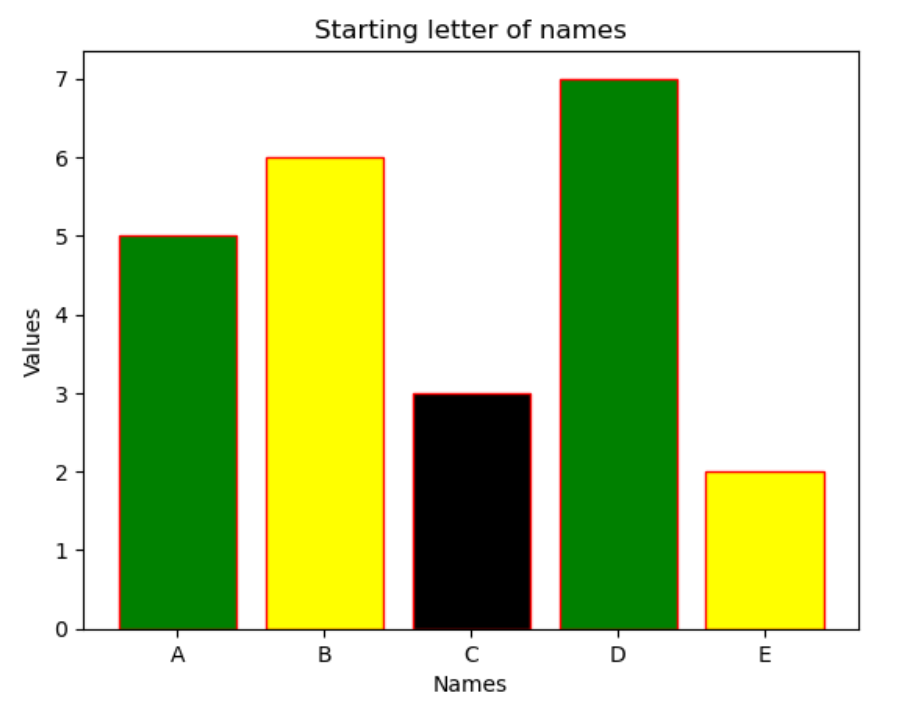
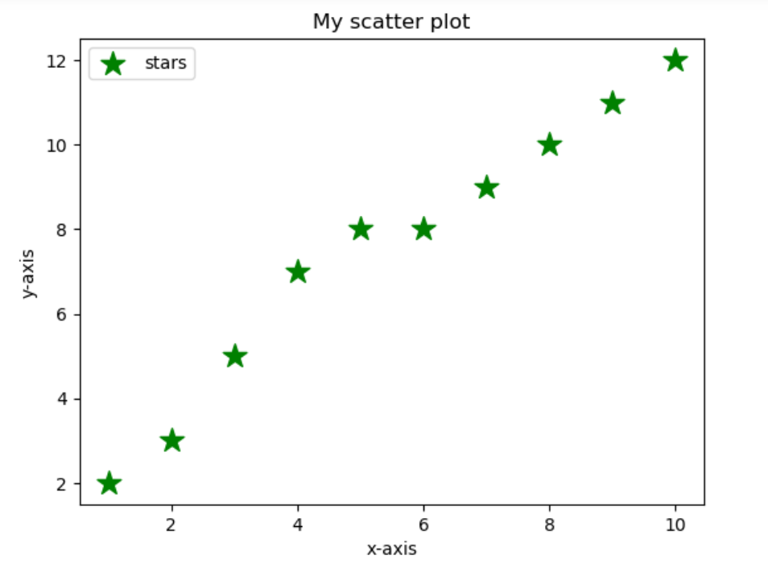
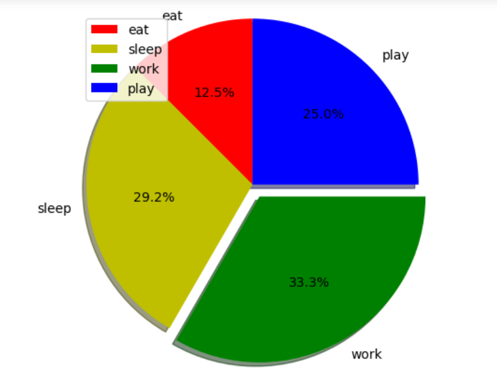

# EXNO-5-DS-DATA VISUALIZATION USING MATPLOT LIBRARY

# Aim:
  To Perform Data Visualization using matplot python library for the given datas.

# EXPLANATION:
Data visualization is the graphical representation of information and data. By using visual elements like charts, graphs, and maps, data visualization tools provide an accessible way to see and understand trends, outliers, and patterns in data.

# Algorithm:
STEP 1:Include the necessary Library.

STEP 2:Read the given Data.

STEP 3:Apply data visualization techniques to identify the patterns of the data.

STEP 4:Apply the various data visualization tools wherever necessary.

STEP 5:Include Necessary parameters in each functions.

# Coding and Output:
```
import numpy as np
import matplotlib.pyplot as plt
from scipy.interpolate import make_interp_spline
import pandas as pd
x_values=[1,2,3,4,5]
y_values=[1,4,9,16,25]
plt.plot(x_values,y_values,color="#e75480",linestyle="solid",marker="s",markersize=12,linewidth=5,markerfacecolor="blue")
plt.legend("line1")
plt.xlabel("X axis")
plt.ylabel("Y axis")
plt.title('Squares') 
plt.grid(True)
plt.show()
```


```
x=np.arange(1,11)
y=np.array([2,3,5,7,8,8,9,10,11,12])
spl=make_interp_spline(x,y)
x_smooth=np.linspace(x.min(),x.max(),100)
y_smooth=spl(x_smooth)
plt.plot(x,y,'o',label='data')
plt.plot(x_smooth,y_smooth,'-',label='spline')
plt.legend()
plt.show()
```


```
years=[i for i in range(2000,2007)]
apples=[0.895,0.91,0.919,0.926,0.931,0.934,0.936]
oranges=[0.962,0.950,0.934,0.926,0.911,0.898,0.891]
plt.plot(years,apples,marker='o')
plt.plot(years,oranges,marker='s')
plt.xlabel("Years")
plt.title("Crop Yield in Kanto")
plt.ylabel("Yield(Tons per hectare)")
plt.legend(["Apples","Oranges"])
```



```
x=[1,2,3,4,5]
y1=[10,12,14,16,18]
y2=[5,7,9,11,13]
y3=[2,4,6,8,10]
plt.fill_between(x,y1,color="blue")
plt.fill_between(x,y2,color="green")
plt.plot(x,y1,color='red')
plt.plot(x,y2,color='black')
plt.legend(['area1','area2'])
```



```
values=[5,6,3,7,2]
names=["A","B","C","D","E"]
c1=['green','yellow','black']
plt.bar(names,values,color=c1,edgecolor='red')
plt.xlabel("Names")
plt.ylabel("Values")
plt.title("Starting letter of names")
plt.show()
```



```
x=np.arange(1,11)
y=np.array([2,3,5,7,8,8,9,10,11,12])
plt.scatter(x,y,label='stars',color='green',marker='*',s=200)
plt.xlabel("x-axis")
plt.ylabel("y-axis")
plt.title("My scatter plot")
plt.legend()
plt.show()
```



```
activities=['eat','sleep','work','play']
slices=[3,7,8,6]
colors=['r','y','g','b']
plt.pie(slices,labels=activities,colors=colors,startangle=90,
       shadow=True,explode=(0,0,0.1,0),
       radius=1.2,autopct="%1.1f%%")
plt.legend(loc='upper left')
plt.show()

```



# Result:
Thus we have performed data visualisation using matplotlib library
